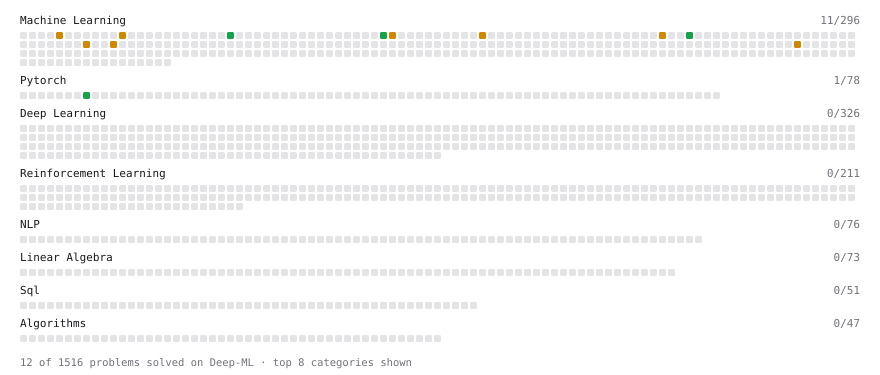

# Deep-ML

My machine learning practice from [Deep-ML](https://www.deep-ml.com). Every solution here was written by hand.

**15** solved · 14 problems · 0 labs · 1 math

[**Browse the interactive portfolio**](https://mittaltanmay.github.io/deep-ml/) to replay this filling in over time.

## Problems

| | Difficulty | Solved | |
| --- | --- | --- | --- |
| [Build an MLP with nn.Sequential](https://www.deep-ml.com/problems/887) | easy | 2026-09-15 | [solution](problems/0887-build-an-mlp-with-nn-sequential) |
| [Implement Early Stopping Based on Validation Loss](https://www.deep-ml.com/problems/135) | easy | 2026-09-20 | [solution](problems/0135-implement-early-stopping-based-on-validation-loss) |
| [Implement Gini Impurity Calculation for a Set of Classes](https://www.deep-ml.com/problems/64) | easy | 2026-09-20 | [solution](problems/0064-implement-gini-impurity-calculation-for-a-set-of-classes) |
| [Implement Hinge Loss for SVM](https://www.deep-ml.com/problems/283) | easy | 2026-10-01 | [solution](problems/0283-implement-hinge-loss-for-svm) |
| [Implement Polynomial Kernel Function](https://www.deep-ml.com/problems/281) | easy | 2026-10-02 | [solution](problems/0281-implement-polynomial-kernel-function) |
| [Calculate Explained Variance Ratio for PCA](https://www.deep-ml.com/problems/350) | medium | 2026-09-26 | [solution](problems/0350-calculate-explained-variance-ratio-for-pca) |
| [Find the Best Gini-Based Split for a Binary Decision Tree](https://www.deep-ml.com/problems/138) | medium | 2026-09-20 | [solution](problems/0138-find-the-best-gini-based-split-for-a-binary-decision-tree) |
| [Generate Sorted Polynomial Features](https://www.deep-ml.com/problems/32) | medium | 2026-09-19 | [solution](problems/0032-generate-sorted-polynomial-features) |
| [Handle Imbalanced Data with SMOTE](https://www.deep-ml.com/problems/357) | medium | 2026-10-02 | [solution](problems/0357-handle-imbalanced-data-with-smote) |
| [Implement K-Fold Cross-Validation](https://www.deep-ml.com/problems/18) | medium | 2026-09-26 | [solution](problems/0018-implement-k-fold-cross-validation) |
| [Implement K-Nearest Neighbors](https://www.deep-ml.com/problems/173) | medium | 2026-09-23 | [solution](problems/0173-implement-k-nearest-neighbors) |
| [Implement RBF (Gaussian) Kernel Function](https://www.deep-ml.com/problems/280) | medium | 2026-10-02 | [solution](problems/0280-implement-rbf-gaussian-kernel-function) |
| [Polynomial Regression Fit](https://www.deep-ml.com/problems/801) | medium | 2026-09-19 | [solution](problems/0801-polynomial-regression-fit) |
| [Reconstruction Error from PCA](https://www.deep-ml.com/problems/353) | medium | 2026-09-26 | [solution](problems/0353-reconstruction-error-from-pca) |

## Math

| | Difficulty | Solved | |
| --- | --- | --- | --- |
| [Margins and Soft-Margin SVMs](https://www.deep-ml.com/math-problems/42) | medium | 2026-09-28 | [solution](math/0042-margins-and-soft-margin-svms) |

---

_This file is regenerated by Deep-ML on every push._
